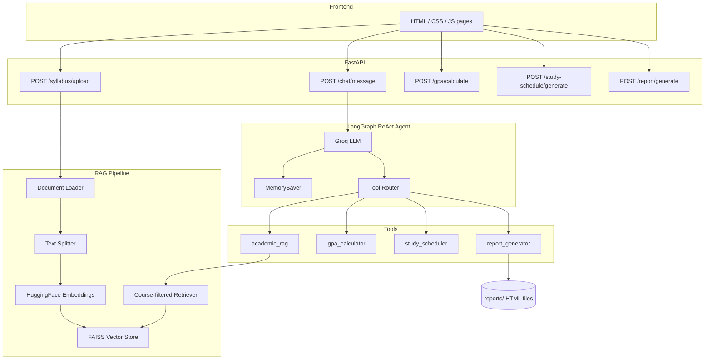

# Academic AI Assistant — Architecture

This document describes the system architecture, component responsibilities, data flow, and technology choices for the Multi-Agent AI Academic Assistant.

## System Overview

The assistant is a FastAPI backend plus a static HTML/CSS/JS frontend. A LangGraph ReAct agent sits between the student and four tools:

1. **academic_rag** — retrieve and answer questions from uploaded syllabi
2. **gpa_calculator** — compute a weighted 4.0 GPA
3. **study_scheduler** — build a day-by-day exam prep plan
4. **report_generator** — emit a downloadable HTML academic summary (automated action)

Conversational memory is stored per `session_id` using LangGraph `MemorySaver`.

## Architecture Diagram

## Pipeline Flow

### 1. Data Retrieval

Students upload PDF, DOCX, or TXT syllabi through `/syllabus/upload`. Files are saved under `uploaded_syllabi/` and ingested by the RAG pipeline:

- `rag/document_loader.py` loads the file
- `rag/text_splitter.py` chunks the text
- `rag/embeddings.py` embeds chunks
- `rag/vector_store.py` writes or appends a FAISS index

If no index exists yet, `tools/rag_tool.py` falls back to `SYLLABUS_PATH` (default `sample_syllabus.txt`).

### 2. Data Processing and Summarization

Chat requests go to `/chat/message`. The ReAct agent decides which tool to call:

- Course policy questions → `academic_rag`
- Grade math → `gpa_calculator`
- Exam prep planning → `study_scheduler`
- Export / report requests → `report_generator`

The agent can call tools sequentially in one turn (for example, calculate GPA, then generate a report).

### 3. Automated Actions

`tools/report_generator.py` builds a formatted HTML academic summary (GPA table + study schedule + notes), writes it to `reports/`, and returns the HTML plus a download URL. The Study Plan page can trigger this from the UI without chatting.

### 4. Workflow Orchestration

LangGraph `create_react_agent` is the orchestrator. FastAPI remains a thin HTTP layer: GPA and study-plan pages can also call their endpoints directly, which is useful for the UI and for tests that should not depend on an LLM.

### 5. Conversational Memory

Each chat request may include `session_id`. That value is passed as LangGraph `thread_id`, so follow-up questions such as "and the midterm?" keep the previous course context.

## Component Descriptions

| Component | Role |
|---|---|
| `main.py` | FastAPI app, CORS, request models, HTTP endpoints |
| `agent/agent.py` | Groq LLM, ReAct agent, tool wrappers, system prompt, memory |
| `tools/rag_tool.py` | Course-aware retrieval and grounded answering |
| `tools/gpa_calculator.py` | Weighted GPA with validation |
| `tools/study_scheduler.py` | Priority-based daily study allocation |
| `tools/report_generator.py` | HTML report generation and disk persistence |
| `rag/*` | Load, split, embed, store, retrieve |
| `frontend/*` | Chat, Upload, GPA, Study Plan, report export |
| `tests/*` | Unit tests and FastAPI integration tests |

## Technology Choices

| Choice | Why |
|---|---|
| FastAPI | Typed HTTP API, easy `TestClient` coverage |
| LangGraph ReAct | Explicit tool-calling loop for multi-step academic tasks |
| Groq | Low-latency LLM inference for interactive chat |
| FAISS + sentence-transformers | Local RAG without a hosted vector database |
| MemorySaver | In-process session memory for the demo / course project |
| Static frontend | Simple to run beside the API; no extra JS build step |
| HTML reports | Printable automated output that does not require email credentials |

## Testing Approach

- Unit tests cover GPA and scheduler validation and core math
- API tests cover health, chat (mocked LLM), upload (mocked RAG write), GPA, study schedule, and report generate/download
- Chat/RAG quality is still demonstrated informally in `test_agent.py` when a Groq key is available
