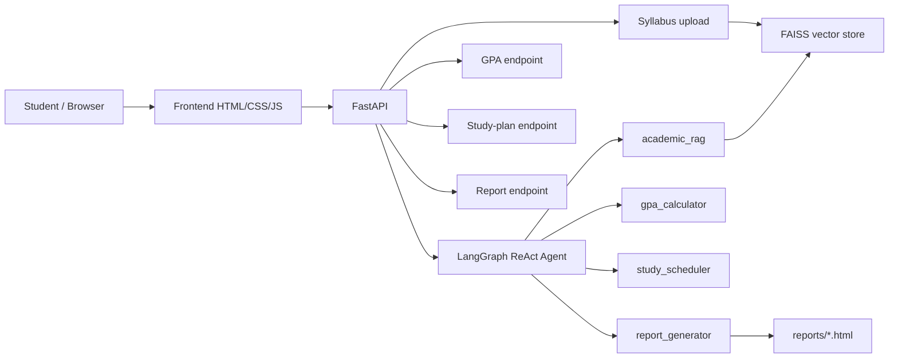

# Academic AI Assistant

Academic AI Assistant is an intelligent university companion that assists students with academic tasks using a Retrieval-Augmented Generation (RAG) pipeline over uploaded course syllabi, automated GPA calculation, personalized study plan scheduling, downloadable academic reports, and a LangGraph ReAct agent with persistent conversational memory.

## Features

- **RAG over Syllabi**: Upload course syllabi (PDF, DOCX, TXT) and retrieve accurate answers grounded in academic course policies, grading breakdowns, office hours, and deadlines.
- **GPA Calculator**: Calculate semester and cumulative GPA dynamically from letter grades or grade points and credit hours.
- **Study Scheduler**: Generate structured, day-by-day study schedules balanced across subjects, difficulty levels, and upcoming exam dates.
- **Academic Report Export**: Generate a formatted HTML summary that combines GPA and study-plan results (automated action).
- **LangGraph ReAct Agent**: Coordinates tools dynamically using reasoning and action steps powered by Groq LLMs.
- **Persistent Conversational Memory**: Retains multi-turn conversation context per session using LangGraph's `MemorySaver` checkpointer and thread IDs for contextual follow-up questions.

---

## Architecture



The agent is the orchestrator for chat. Direct GPA, study-plan, and report endpoints exist so the UI can run those workflows without an extra LLM round-trip. See [ARCHITECTURE.md](ARCHITECTURE.md) for component details and data flow.

### Pipeline flow

1. **Retrieve** — upload a syllabus (or fall back to `sample_syllabus.txt`) and index it in FAISS.
2. **Process** — the ReAct agent selects GPA, scheduling, or RAG tools from the user question.
3. **Summarize** — grounded answers and computed results are returned in chat or on the dedicated pages.
4. **Act** — `report_generator` writes a downloadable HTML academic summary to `reports/`.

---

## Setup

```bash
python -m venv .venv
source .venv/bin/activate    # Windows: .venv\Scripts\activate
pip install -r requirements.txt
cp .env.example .env         # then edit .env with your GROQ_API_KEY
```

### Run Backend

```bash
uvicorn main:app --host 0.0.0.0 --port 8001 --reload
```

### Run Frontend

Open `frontend/index.html` in a web browser, or serve it using Python's built-in HTTP server:

```bash
cd frontend
python -m http.server 5500
```

---

## Testing

```bash
python -m pytest tests/ -v
```

- `tests/test_gpa_calculator.py` — unit tests for weighted GPA, failing grades, and invalid input
- `tests/test_study_scheduler.py` — unit tests for schedule generation, priority, and date validation
- `tests/test_api.py` — FastAPI `TestClient` coverage for health, chat, upload, GPA, study plan, and reports

Chat tests mock the LLM so the suite does not require a live Groq key. Informal live-agent checks remain in `test_agent.py`. Documented results are in `evaluation_report.md`.

---

## API Endpoints

| Method | Endpoint | Description |
|---|---|---|
| `GET` | `/` | Root status message |
| `GET` | `/health` | Service health status check |
| `POST` | `/chat/message` | Send a question to the agent with `session_id` for stateful conversation |
| `POST` | `/syllabus/upload` | Upload a syllabus file (PDF, DOCX, TXT) and append to vector store |
| `GET` | `/syllabus/status` | Check if a syllabus FAISS index is loaded |
| `POST` | `/gpa/calculate` | Compute semester GPA from course grades and credit hours |
| `POST` | `/study-schedule/generate` | Generate a balanced study schedule based on exams and availability |
| `POST` | `/report/generate` | Generate an HTML academic summary (GPA + study plan) and save it |
| `GET` | `/report/download/{filename}` | Download a previously generated HTML report |

---

## Example Questions & Demonstrations

### 1. RAG over Syllabus
> "What percentage is the final exam in the AI course?"
> "What happens if I submit an assignment 48 hours late?"

### 2. GPA Calculation
> "Calculate my GPA for: AI (A, 3 credits), Networks (B+, 3 credits), Algorithms (A-, 2 credits)."

### 3. Study Scheduling
> "Create a study schedule for AI (hard, exam on 2026-08-28) and Networks (medium, exam on 2026-08-30) with 4 available hours per day."

### 4. Automated Report
> "Generate an academic report for student Alex Johnson using my GPA and study plan."
> Or use **Export Report** on the Study Plan page.

### 5. Conversational Memory & Multi-turn Follow-ups
> **Turn 1:** "What percentage is the final exam?"
> **Turn 2:** "And what about the midterm?"
> **Turn 3:** "Remind me what I asked first."

---

## Project Structure

```
AcademicAIAssistant/
├── .env.example
├── ARCHITECTURE.md
├── README.md
├── evaluation_report.md
├── requirements.txt
├── sample_syllabus.txt
├── main.py
├── test_agent.py
├── agent/
│   ├── __init__.py
│   └── agent.py
├── frontend/
│   ├── index.html
│   ├── css/
│   │   └── style.css
│   ├── js/
│   │   ├── chat.js
│   │   ├── gpa.js
│   │   ├── report.js
│   │   ├── study-plan.js
│   │   └── upload.js
│   └── pages/
│       ├── chat.html
│       ├── gpa.html
│       ├── study-plan.html
│       └── upload.html
├── rag/
│   ├── document_loader.py
│   ├── embeddings.py
│   ├── retriever.py
│   ├── text_splitter.py
│   └── vector_store.py
├── reports/
├── tests/
│   ├── __init__.py
│   ├── conftest.py
│   ├── test_api.py
│   ├── test_gpa_calculator.py
│   └── test_study_scheduler.py
└── tools/
    ├── __init__.py
    ├── gpa_calculator.py
    ├── rag_tool.py
    ├── report_generator.py
    └── study_scheduler.py
```
